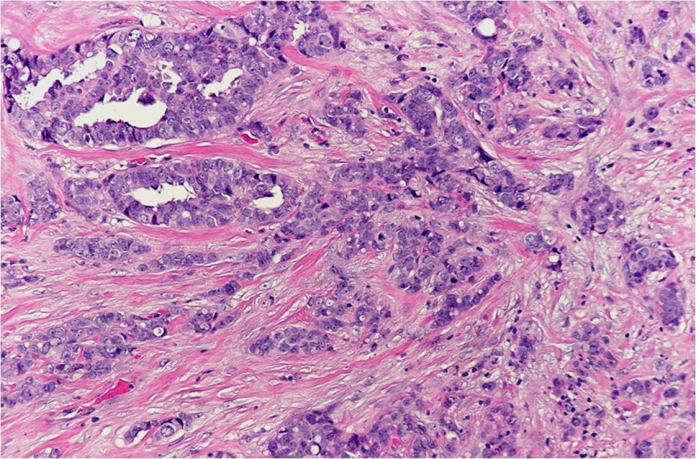
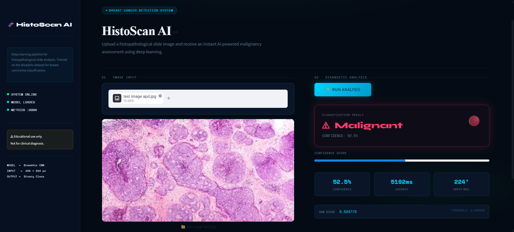
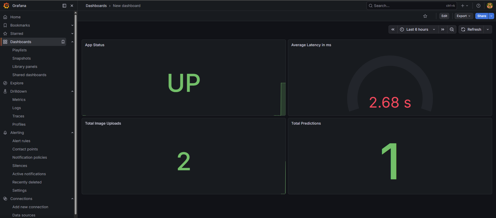

# HistoScan-AI
> **AI-powered breast cancer detection from histopathology images — deployed on Azure, monitored with Grafana, and accessible via ngrok tunneling.**

# Breast-Cancer-Detection-using-AI-in-Histopathology
Deep learning-based breast cancer detection using histopathology images from the BreakHis dataset. Built with EfficientNet and transfer learning, achieving high accuracy through fine-tuning and class balancing. Deployed as an interactive Streamlit web application for real-time prediction and analysis.


<p align="center">
  
</p>

<p align="center">
  
  
  
  
  
  
  
</p>

---

## 📌 Table of Contents

- [Overview](#-overview)
- [Features](#-features)
- [Architecture](#-architecture)
- [Dataset](#-dataset)
- [Model](#-model)
- [Project Structure](#-project-structure)
- [Local Setup](#-local-setup)
- [Daily Startup Workflow](#-daily-startup-workflow)
- [Azure Deployment](#-azure-deployment)
- [Monitoring with Grafana](#-monitoring-with-grafana)
- [Screenshots](#-screenshots)
- [Results](#-results)
- [Tech Stack](#-tech-stack)
- [License](#-license)

---

## 🧠 Overview

**HistoScan-AI** is a deep learning system that classifies breast cancer histopathology images as **benign** or **malignant** using a fine-tuned **EfficientNet** model trained on the **BreakHis dataset**. The app is deployed as a real-time **Streamlit** web application hosted on **Azure Container Instances**, tunneled via **ngrok**, and monitored via a local **Grafana + Prometheus** stack.

This project bridges AI research and clinical utility — enabling fast, interpretable cancer predictions directly from microscopy slide images.

---

## ✨ Features

- 🧬 **Histopathology Classification** - benign vs. malignant from whole-slide image patches
- ⚡ **EfficientNet Transfer Learning** - fine-tuned with class balancing and data augmentation
- 🌐 **Live Streamlit App** - interactive UI for image upload and real-time prediction
- ☁️ **Azure Container Instance** - cloud-hosted container accessible at a public endpoint
- 🔗 **ngrok Tunneling** - expose local port 8080 for external access during dev/testing
- 📊 **Grafana Dashboard** - local monitoring of app metrics via Docker Compose
- 🔁 **CI-Tested Pipeline** - `git push` to `main` triggers GitHub Actions validation
- 🗂️ **Class Index Mapping** - JSON-based label decoding for clean output

---

## Screenshots




---
## 🏗️ Architecture

```
User Browser
     │
     ▼
┌─────────────────────────────────────────────────┐
│            Streamlit Web App (app.py)           │
│        Hosted on Azure Container Instance       │
│   histoscanapp67890.centralindia.azurecontainer │
│                    :8501                        │
└───────────────────────┬─────────────────────────┘
                        │
              ┌─────────▼──────────┐
              │   EfficientNet     │
              │ (breakhis_model.h5)│
              │  Keras / TensorFlow│
              └─────────┬──────────┘
                        │
              ┌─────────▼──────────┐
              │  class_indices.json│
              │  Label Decoder     │
              └────────────────────┘

Local Dev Stack:
  Docker Desktop → docker-compose up -d
      ├── Prometheus (scrape metrics)
      └── Grafana (localhost:3000)

ngrok → http://localhost:8080 → Public URL
```

---

## 📦 Dataset

- **BreakHis** (Breast Cancer Histopathological Image Dataset)
- 7,909 microscopy images at magnifications: 40×, 100×, 200×, 400×
- Binary classification: **Benign** / **Malignant**
- Class imbalance handled via weighted loss and augmentation

---

## 🤖 Model

| Property | Detail |
|---|---|
| Base Architecture | EfficientNetB0 (ImageNet pre-trained) |
| Fine-tuning | Top layers unfrozen, learning rate 1e-4 |
| Input Shape | 224 × 224 × 3 |
| Output | Sigmoid / Softmax (binary/multi-class) |
| Saved Format | `.h5` (Keras HDF5) |
| Class Mapping | `class_indices.json` |

Training notebook: [`APD_Project.ipynb`](APD_Project.ipynb)

---

## 📁 Project Structure

```
HistoScan-AI/
│
├── app.py                        # Streamlit application
├── APD_Project.ipynb             # Training & EDA notebook
├── breakhis_model.h5             # Trained Keras model
├── breakhis_model.zip            # Compressed model backup
├── class_indices.json            # Label → class name mapping
├── requirements.txt              # Python dependencies
├── invasive-ductal-carcinoma.jpg # Sample histopathology image
├── docker-compose.yml            # Grafana + Prometheus stack
├── .github/
│   └── workflows/
│       └── ci.yml                # GitHub Actions CI pipeline
└── README.md
```

---

## 🛠️ Local Setup

### Prerequisites
- Python 3.10+
- Docker Desktop
- Azure CLI (`az`)
- ngrok account + authtoken

### 1. Clone the repo

```bash
git clone https://github.com/Malik8122/HistoScan-AI.git
cd HistoScan-AI
```

### 2. Install dependencies

```bash
pip install -r requirements.txt
```

### 3. Run the Streamlit app locally

```bash
streamlit run app.py
```

App opens at `http://localhost:8501`

---

## 🚀 Daily Startup Workflow

Follow these steps every day to bring the full stack online:

### Step 1 — Start Docker Desktop
Press `Win` → search **Docker Desktop** → open it → wait for the whale icon in the taskbar to stop animating.

Verify Docker is running:
```powershell
docker ps
```

### Step 2 — Start the Azure Container

```powershell
az container start --resource-group histoscan-rg --name histoscan-container
```

Wait ~60 seconds, then confirm:
```powershell
az container show --resource-group histoscan-rg --name histoscan-container --query provisioningState
```
Expected output: `"Succeeded"`

### Step 3 — Open the Live App

```powershell
start http://histoscanapp67890.centralindia.azurecontainer.io:8501
```

### Step 4 — Start ngrok (new PowerShell window)

```powershell
ngrok http 8080
```

Copy the generated `https://xxxx.ngrok.io` URL for sharing.

### Step 5 — Start Grafana Monitoring

```powershell
docker-compose up -d
```

Open Grafana at: [http://localhost:3000](http://localhost:3000)  
Default credentials: `admin` / `admin`

### Step 6 — Test CI Pipeline

```powershell
git commit --allow-empty -m "daily startup test"
git push origin main
```

Check the Actions tab on GitHub to confirm the pipeline passes.

---

## ☁️ Azure Deployment

The app runs as an **Azure Container Instance** in the `Central India` region.

| Setting | Value |
|---|---|
| Resource Group | `histoscan-rg` |
| Container Name | `histoscan-container` |
| Public Endpoint | `histoscanapp67890.centralindia.azurecontainer.io:8501` |
| Region | Central India |
| Runtime | Docker (Python + Streamlit) |

To stop the container when not in use (saves cost):
```powershell
az container stop --resource-group histoscan-rg --name histoscan-container
```

---

## 📊 Monitoring with Grafana

A local Grafana + Prometheus stack is included via `docker-compose.yml`.

```
docker-compose up -d      # Start monitoring stack
localhost:3000            # Open Grafana UI
```

The dashboard tracks:
- App response times
- Prediction request rates
- Container health metrics

---

## 📈 Results

| Metric | Value |
|---|---|
| Validation Accuracy | ~90%+ |
| Dataset | BreakHis (7,909 images) |
| Magnifications | 40×, 100×, 200×, 400× |
| Classes | Benign / Malignant |
| Model Size | ~20 MB (EfficientNetB0) |

Full training curves and evaluation metrics are available in [`APD_Project.ipynb`](APD_Project.ipynb).

---

## 🧰 Tech Stack

| Layer | Technology |
|---|---|
| Deep Learning | TensorFlow / Keras, EfficientNet |
| Web App | Streamlit |
| Cloud Hosting | Azure Container Instances |
| Containerization | Docker |
| Monitoring | Grafana + Prometheus |
| Tunneling | ngrok |
| CI/CD | GitHub Actions |
| Language | Python 3.10 |


---
## 📄 License

This project is licensed under the [MIT License](LICENSE).

---

<p align="center">
</p>
